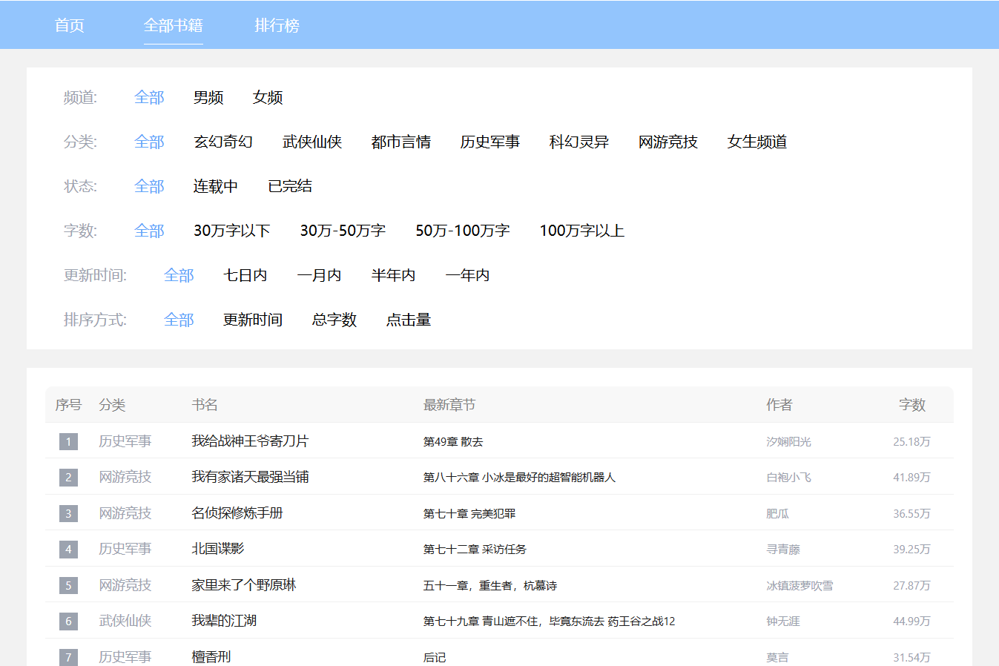

### 项目介绍

本项目是基于 Vue3 + SpringBoot3 开发的前后端分离的小说阅读项目。项目包含小说推荐、排行榜、阅读、评论、历史阅读、个人书架、个人信息等功能

### 开发环境

#### 后端技术

|    技术    |  版本  |         说明          |
| :--------: | :----: | :-------------------: |
| SpringBoot | 3.4.5  |    容器 + MVC 框架    |
|   MySQL    | 8.0.32 |     关系型数据库      |
|   Jimmer   | 0.9.64 |   JVM中最先进的ORM    |
|   Redis    |  7.0   |    分布式缓存支持     |
|  Knife4j   | 4.5.0  | 基于Swagger的 API文档 |
|  Java-Jwt  | 4.4.0  |     登录认证支持      |
|  kaptcha   | 2.3.2  |    生成验证码图片     |

#### 前端技术

|      技术      |    版本    |               说明               |
| :------------: | :--------: | :------------------------------: |
|     Vue.js     |   3.5.13   |      渐进式 JavaScript 框架      |
|   Vue Router   |   4.5.0    |        Vue.js 的官方路由         |
|     Pinia      |   3.0.1    |          Vue 状态管理库          |
|     Axios      |   1.9.0    |    基于 promise 的网络请求库     |
| Ant Design Vue |   2.2.0    | 基于 Ant Design 的 Vue UI 组件库 |
|     Unocss     |   66.3.1   |    即时按需的原子化 CSS 引擎     |
|     Dayjs      | 4.0.0-rc.6 |         轻量的日期工具库         |

### 项目截图

首页

分类

排行榜

搜索

详情

阅读页

个人书架

